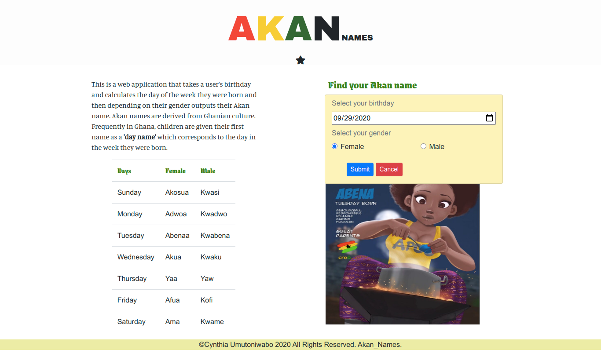

# AKAN names

#### The Akan people of Ghana frequently name their children after the day of the week they were born and the order in which they were born. These "day names" have further meanings concerning the soul and character.

## Description
This is an application that find your Akan name based on your birthday and gender you selected.

Here is how it looks like  
    

Live demo :arrow_right: [Akan_names](https://ucynthy12.github.io/akan_names/)

## Setup/Installation Requirements 
* Select your **birthday**
* Select your **gender**
* Submit to find your Akan name
## Credits
 . [Font Awesome](https://fontawesome.com/)  
 . [Google fonts](https://fonts.google.com/)   
 . [Bootstrap](https://getbootstrap.com/docs/4.0/getting-started/introduction/)

## Features

1. HTML5 + CSS3.
1. Javascript.
2. Fully responsive.
3. Compatible with all modern browser.
## Known Bugs  
Still fixing responsiveness of the application  

## Support and Contact details
For more contribution on my application, please fork and send some request.

1. Email: *ucynthy12@gmail.com*
2. Github 
     .username: **ucynthy12**   
     .name: **Cynthia Umutoniwabo**

### License  

Copyright (c) [2020] [Cynthia Umutoniwabo]

Permission is hereby granted, free of charge, to any person obtaining a copy
of this software and associated documentation files (the "Software"), to deal
in the Software without restriction, including without limitation the rights
to use, copy, modify, merge, publish, distribute, sublicense, and/or sell
copies of the Software, and to permit persons to whom the Software is
furnished to do so, subject to the following conditions:

The above copyright notice and this permission notice shall be included in all
copies or substantial portions of the Software.

THE SOFTWARE IS PROVIDED "AS IS", WITHOUT WARRANTY OF ANY KIND, EXPRESS OR
IMPLIED, INCLUDING BUT NOT LIMITED TO THE WARRANTIES OF MERCHANTABILITY,
FITNESS FOR A PARTICULAR PURPOSE AND NONINFRINGEMENT. IN NO EVENT SHALL THE
AUTHORS OR COPYRIGHT HOLDERS BE LIABLE FOR ANY CLAIM, DAMAGES OR OTHER
LIABILITY, WHETHER IN AN ACTION OF CONTRACT, TORT OR OTHERWISE, ARISING FROM,
OUT OF OR IN CONNECTION WITH THE SOFTWARE OR THE USE OR OTHER DEALINGS IN THE
SOFTWARE.